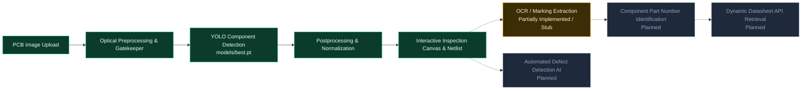
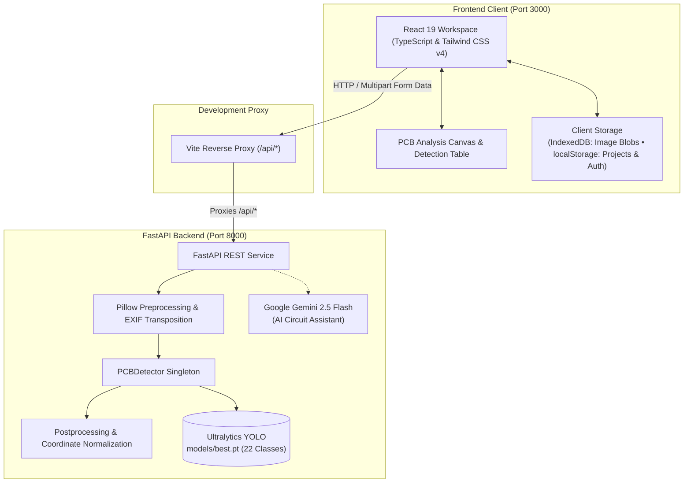

# CircuSense AI

> **Scan. Sense. Understand.**  
> *AI-Powered PCB Component Intelligence Platform*

[](https://react.dev/)
[](https://www.typescriptlang.org/)
[](https://vitejs.dev/)
[](https://tailwindcss.com/)
[](https://fastapi.tiangolo.com/)
[](https://www.python.org/)
[](https://docs.ultralytics.com/)

**CircuSense AI** is an AI-assisted printed circuit board (PCB) inspection and component detection platform. Powered by an authoritative, locally hosted **Ultralytics YOLO** model (`models/best.pt`) trained on 22 hardware package classes, CircuSense AI identifies components on physical PCB photographs, maps precise bounding boxes, synchronizes detections with a netlist table, and provides an interactive hardware inspection canvas with guided troubleshooting tools.

---

## Overview

Physical printed circuit boards are becoming denser, smaller, and more complex. Manual optical inspection and benchtop troubleshooting often require engineers and technicians to spend hours locating surface-mount devices (SMD), tracing connections under a microscope, deciphering microscopic package markings, and manually looking up datasheets.

**CircuSense AI** addresses this challenge by providing an end-to-end computer vision workspace. When an optical photograph of a physical PCB is uploaded, the platform:
1. Validates optical substrate characteristics in the browser to ensure the image is a physical PCB.
2. Ingests the image through a Python FastAPI inference backend.
3. Runs a locally hosted YOLO object detector (`models/best.pt`) across 22 trained component classes.
4. Returns normalized bounding boxes, confidence ratings, and category groupings.
5. Renders the detections on an interactive canvas with pan, zoom, netlist tables, component inspection panels, and AI-assisted engineering chat.

---

## Problem

Manual optical PCB inspection and assembly auditing present several practical challenges:

- **Component Identification Under High Density**: Modern SMD packages (e.g., 0402/0603 resistors and ceramic capacitors) look nearly identical to the naked eye.
- **Microscopic Markings**: Laser-etched chip codes and silkscreen labels are difficult to read without high-magnification optical equipment.
- **Fragmented Technical Information**: Pinouts, maximum ratings, and reference circuits are spread across scattered PDF datasheets.
- **Disorganized BOM & Netlists**: Manually cataloging parts on prototype or legacy boards with missing documentation is time-consuming.
- **Unfamiliar Board Diagnostics**: Repair technicians working on undocumented hardware lack immediate visual guidance for test points and voltage rails.

---

## Solution

CircuSense AI structures the optical inspection process into a clear pipeline:

```text
[PCB Image Upload] ──► [Optical Gatekeeper] ──► [YOLO Detection] ──► [Component Inspection] ──► [Structured Results & Netlist]
```

1. **Optical Image Ingestion**: Accepts standard JPG, PNG, or WEBP board photographs.
2. **Authoritative YOLO Detection**: Evaluates component packages locally using real neural weights (`models/best.pt`), avoiding third-party cloud vision dependencies for detection.
3. **Interactive Visual Intelligence**: Displays components with color-coded bounding boxes, synchronized netlist tables, and parameter inspectors.
4. **Structured Engineering Output**: Allows technicians to audit component distributions, enter bench multimeter (DMM/ESR) readings, and export audit reports as JSON.

---

## Key Features

- **Authoritative YOLO Component Detection**: Identifies physical components across 22 hardware classes using a trained Ultralytics YOLO model (`models/best.pt`).
- **Interactive PCB Analysis Canvas**: High-performance canvas supporting smooth panning, 40%–400% zoom, box selection, label toggles, and category filtering.
- **Synchronized Netlist Table**: Searchable, sortable table linked directly to canvas bounding boxes with hover highlighting and parameter views.
- **Deep Component Inspector**: Inspects raw pixel bounds, 0–100% normalized coordinates, confidence tiers, and hardware classifications with a single click.
- **In-Browser Optical Gatekeeper**: Fast client-side Computer Vision pre-filter (`pcbValidator.ts`) evaluating solder mask colors, trace gradients, and luminance to reject non-PCB images before upload.
- **Dual Client-Side Storage**: Leverages **IndexedDB** for full-resolution image blobs and **localStorage** for project metadata, preventing browser storage quota errors.
- **Offline Benchmark Boards**: Three pre-configured hardware boards (*5V Linear Power Supply*, *ESP32 IoT Hub*, *L298N Motor Driver*) for testing without camera hardware.
- **AI Circuit Assistant**: Conversational troubleshooting assistant powered by Google Gemini (`gemini-2.5-flash`) with an automated offline engineering fallback.
- **Bench Diagnostic Verification Guide**: Step-by-step modal for entering physical DMM and ESR measurements to verify hardware before component replacement.
- **Report Export**: Exports structured PCB component audit reports directly to JSON.
- **Responsive Interface & Dark Mode**: Professional dark/light mode design system built with Tailwind CSS v4.

---

## AI Workflow

The following diagram illustrates the current analysis pipeline versus planned future stages:



---

## System Architecture



---

## AI Model

- **Architecture**: Ultralytics YOLO Object Detection Model
- **Weights File**: `models/best.pt` (~5.38 MB)
- **Task**: `detect` (2D bounding box regression & multi-class classification)
- **Input Resolution**: 640×640 px
- **Default Confidence Threshold**: 0.25
- **Default IoU Threshold**: 0.45
- **Execution**: Local CPU or CUDA via PyTorch

### Supported Component Classes (22 Classes)

| ID | Class Name | Category Group | ID | Class Name | Category Group |
|:---:|:---|:---|:---:|:---|:---|
| `0` | `battery` | Power | `11` | `inductor` | Passive |
| `1` | `button` | Electromechanical | `12` | `led` | Semiconductor |
| `2` | `buzzer` | Electromechanical | `13` | `pads` | Mechanical / PCB Feature |
| `3` | `capacitor` | Passive | `14` | `pins` | Connector |
| `4` | `clock` | Semiconductor | `15` | `potentiometer` | Passive |
| `5` | `connector` | Connector | `16` | `relay` | Electromechanical |
| `6` | `diode` | Semiconductor | `17` | `resistor` | Passive |
| `7` | `display` | Display | `18` | `switch` | Electromechanical |
| `8` | `fuse` | Power | `19` | `transducer` | Electromechanical |
| `9` | `heatsink` | Mechanical / PCB Feature | `20` | `transformer` | Power |
| `10` | `ic` | Semiconductor | `21` | `transistor` | Semiconductor |

---

## Tech Stack

| Layer | Technology | Details / Usage |
|---|---|---|
| **Frontend** | React 19, TypeScript, Tailwind CSS v4 | Component-based UI, design tokens, responsive layouts |
| **Build & Dev Tool** | Vite 6.2 | Fast bundler with built-in `/api/*` reverse proxy |
| **Inference Backend** | Python FastAPI, Uvicorn, Pydantic v2 | Async REST API serving inference endpoints and telemetry |
| **Object Detection (CV)** | Ultralytics YOLO, PyTorch | Authoritative detector loading `models/best.pt` (22 classes) |
| **Image Preprocessing** | Pillow, OpenCV | EXIF rotation correction, RGB conversion, crop reader |
| **Client Storage** | IndexedDB, browser `localStorage` | IndexedDB for image binaries; localStorage for project state |
| **AI Assistant** | Google Gemini (`gemini-2.5-flash`) | Context-aware circuit reasoning with offline fallback |
| **Iconography & Motion** | Lucide React, Motion | Engineering icons and UI transitions |

---

## Project Structure

```text
CircuSenseAI/
├── backend/                 # Python FastAPI inference service
│   ├── app.py               # API endpoints, lifespan management, CORS
│   ├── detector.py          # PCBDetector singleton wrapping Ultralytics YOLO
│   ├── preprocessing.py     # Image decoding, EXIF orientation, RGB conversion
│   ├── postprocessing.py    # Box coordinate clamping, normalization, category mapping
│   ├── ocr.py               # Marking extraction stub
│   ├── schemas.py           # Pydantic request/response contracts
│   ├── test_backend.py      # Backend unit test suite
│   └── requirements.txt     # Python backend dependencies
├── context/                 # Persistent architectural and workflow documentation
│   ├── Project Overview.md  # Core project specifications
│   ├── Architecture.md      # Detailed system blueprints
│   ├── AI Workflow Types.md # AI pipeline definitions (A through G)
│   ├── Code Standards.md    # Development conventions and rules
│   └── Progress Tracker.md  # Master subsystem and bug tracking
├── models/                  # Trained machine learning model weights
│   ├── best.pt              # Authoritative 22-class YOLO weights (~5.38 MB)
│   └── README.md            # Model specifications and taxonomy
├── public/assets/           # Static assets and sample PCB images
├── src/                     # React 19 application source code
│   ├── components/          # Canvas, inspector, netlist table, modals, auth
│   ├── pages/               # Analyzer, Results, Components, Faults, Settings
│   ├── services/            # detectionApi, pcbApi, pcbValidator, storageService
│   ├── types/               # TypeScript domain interfaces
│   ├── App.tsx              # Root application workspace controller
│   └── index.css            # Tailwind CSS v4 theme directives
├── .env.example             # Environment configuration template
├── package.json             # Frontend dependencies and npm scripts
└── README.md                # Project README
```

---

## Getting Started

### Prerequisites

- **Node.js**: v18.0.0 or higher
- **Python**: v3.10 or v3.11 (*Note: Python 3.14 is currently not supported by PyTorch and Ultralytics binary wheels on Windows*)
- **Git**

---

### 1. Backend Setup (FastAPI & YOLO)

1. Create a Python virtual environment and activate it:
   ```powershell
   # Windows (PowerShell)
   python -m venv backend\.venv
   backend\.venv\Scripts\Activate.ps1
   ```
   ```bash
   # Linux / macOS
   python3 -m venv backend/.venv
   source backend/.venv/bin/activate
   ```

2. Install backend dependencies:
   ```bash
   pip install -r backend/requirements.txt
   ```

3. Ensure the model weights exist at `models/best.pt` (included in repository).

4. Start the FastAPI backend service:
   ```bash
   uvicorn backend.app:app --host 127.0.0.1 --port 8000 --reload
   ```

- Backend API: `http://127.0.0.1:8000`
- Interactive Swagger Docs: `http://127.0.0.1:8000/docs`

---

### 2. Frontend Setup (React & Vite)

1. In a separate terminal, install dependencies:
   ```bash
   npm install
   ```

2. *(Optional)* Copy the environment configuration:
   ```bash
   cp .env.example .env
   ```

3. Start the Vite development server:
   ```bash
   npm run dev
   ```

- Frontend Application: `http://localhost:3000`

> **Note on Proxying**: Vite automatically reverse-proxies `/api/*` calls from `http://localhost:3000/api/*` to the FastAPI backend at `http://127.0.0.1:8000/api/*`.

---

## API Endpoints

| Method | Endpoint | Description |
|---|---|---|
| `GET` | `/api/health` | Returns service health, loaded model status, 22 class count, and compute device (`cpu`/`cuda`). |
| `GET` | `/api/model-info` | Returns complete 22-class taxonomy, default thresholds (0.25 conf, 0.45 IoU), and input resolution (640). |
| `POST` | `/api/detect-pcb` | Multipart image upload running authoritative YOLO inference; returns normalized bounding boxes and metrics. |
| `POST` | `/api/verify-pcb` | Base64 payload validation checking image header validity. |
| `POST` | `/api/chat-pcb` | AI assistant endpoint querying Gemini 2.5 Flash with detection context *(Note: current frontend/backend field mismatch under Phase 1 stabilization)*. |

---

## Testing & Verification

CircuSense AI includes the following verification scripts:

- **Backend Unit Tests**:
  ```bash
  python backend/test_backend.py
  ```
  *Executes 4 automated unit tests verifying health, model info, invalid image rejection, and sample tensor inference.*

- **End-to-End Integration Verification**:
  ```bash
  python backend/e2e_verification.py
  ```
  *Tests live proxy communication, real PCB image detection, and chat fallback responses against active servers.*

- **Frontend Type Checking**:
  ```bash
  npm run lint
  ```
  *Executes `tsc --noEmit` across the entire React/TypeScript codebase.*

- **Production Build Validation**:
  ```bash
  npm run build
  ```

---

## Current Status

### Implemented
- Local 22-class Ultralytics YOLO object detection (`models/best.pt`).
- FastAPI inference backend with multipart upload and coordinate normalization.
- Interactive PCB Analysis Canvas with pan, zoom, overlays, and filter pills.
- Synchronized Detection Table and Component Inspector.
- In-browser optical validation gatekeeper (`pcbValidator.ts`).
- Dual client storage (IndexedDB for image blobs, localStorage for projects).
- Offline benchmark boards with mock components and pinouts.
- JSON audit report export.

### In Progress (Phase 1 — Core Stabilization)
- Resolving the AI chat context contract mismatch (`boardContext` vs `analysisContext`).
- Unifying Dashboard drag-and-drop to immediately invoke real YOLO inference.
- Stabilizing the Python runtime environment across operating systems.
- Reconciling TypeScript path aliases (`tsconfig.json` vs `vite.config.ts`).

### Planned
- Silkscreen Optical Character Recognition (OCR) integration via Tesseract.
- Automated optical defect detection model (solder bridges, cracks, burnt pads).
- Dynamic component identification and live datasheet API retrieval (e.g., Octopart/DigiKey).
- Server-side persistent database (PostgreSQL/SQLite) and multi-user authentication.
- True RAG / vector search architecture for circuit manuals.
- Docker containerization and CI/CD pipelines.

---

## Known Limitations

- **Optical vs. Electrical Reality**: A 2D photograph cannot verify internal silicon die integrity, trace continuity under BGA packages, or electrical capacitance values.
- **Microscopic Markings**: Legibility of laser-etched markings depends heavily on camera resolution, lighting, and glare.
- **Package-Only Detection**: The current YOLO model detects component classes (e.g., `ic`, `capacitor`), not specific commercial part numbers or physical defects.
- **OCR Incomplete**: OCR logic in `backend/ocr.py` is currently a stub; dependencies are not bundled.
- **Client-Side Persistence**: Projects and user accounts are stored in browser memory; clearing browser data removes saved records.
- **Static Datasheets**: Only 4 components currently have datasheet records; dynamic part lookup is not yet active.
- **Cosmetic Vector Store Indicator**: The "RAG Vector Store" UI badge on the chat page is a UI indicator; a vector database is not yet installed.

---

## Roadmap

| Phase | Milestone | Status |
|---|---|---|
| **Phase 1** | **Core Stabilization** (Python env, chat contract fix, upload flow unification) | **In Progress** |
| **Phase 2** | **OCR & Marking Extraction** (Tesseract integration, silkscreen text parsing) | Planned |
| **Phase 3** | **Persistence & Authentication** (Server database, JWT auth, persistent audits) | Planned |
| **Phase 4** | **Datasheet & Part Intelligence** (Octopart/DigiKey API integration, dynamic pinouts) | Planned |
| **Phase 5** | **PCB Defect Detection** (Trained visual anomaly model for solder/package flaws) | Planned |
| **Phase 6** | **Deployment & Testing** (Docker containers, Vitest frontend suite, CI/CD) | Planned |

---

## Project Vision

The long-term vision of CircuSense AI is to transform flat circuit board photographs into rich, structured hardware intelligence. By combining high-accuracy object detection, optical character recognition, electronic component knowledge graphs, and multimodal generative reasoning, CircuSense AI aims to automate netlist reconstruction, accelerate hardware repair, and provide accessible diagnostic capabilities to electronics engineers worldwide.

---

## Safety & Engineering Notice

> **Important Engineering Protocol**: Optical inspection provides surface-level package identification and visual assistance. A photograph alone cannot verify internal electrical integrity, component tolerances, or operational safety. Always verify voltage rails, ground continuity, and component values with a calibrated digital multimeter (DMM), ESR meter, or oscilloscope before applying power or replacing components.

---

## Contributing & Development Guidelines

Contributors and AI assistants should review the comprehensive project documentation in the [`context/`](context/) directory before making significant architectural changes:

- [`context/Project Overview.md`](context/Project%20Overview.md) — Product requirements and taxonomy.
- [`context/Architecture.md`](context/Architecture.md) — Detailed system and service blueprints.
- [`context/AI Workflow Types.md`](context/AI%20Workflow%20Types.md) — AI and CV pipeline definitions.
- [`context/Code Standards.md`](context/Code%20Standards.md) — Engineering standards for frontend and backend.
- [`context/Progress Tracker.md`](context/Progress%20Tracker.md) — Master issue tracker and phase checklist.
- [`context/AI Assistant Instructions.md`](context/AI%20Assistant%20Instructions.md) — Rules of engagement for AI coding assistants.

---

## License

License information will be added as the project is finalized.
